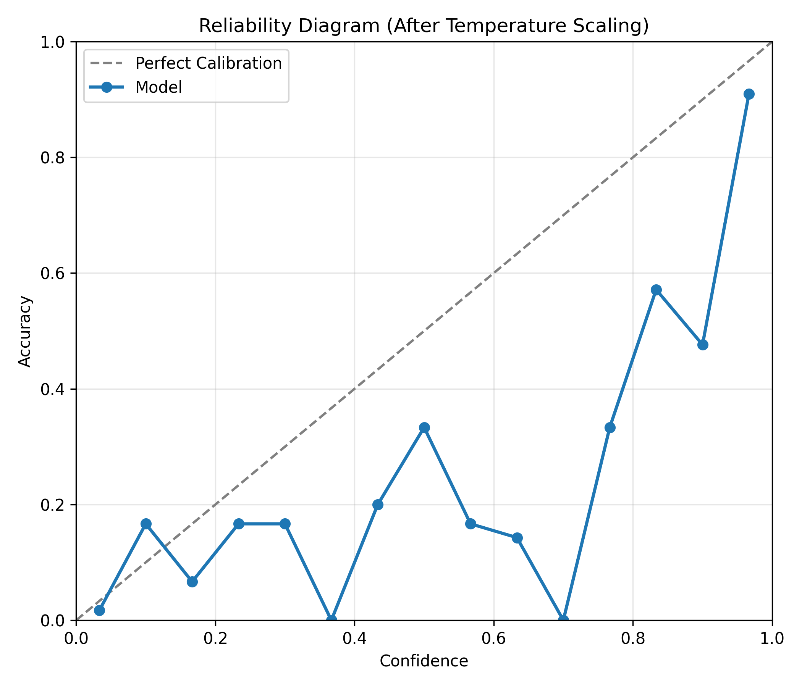
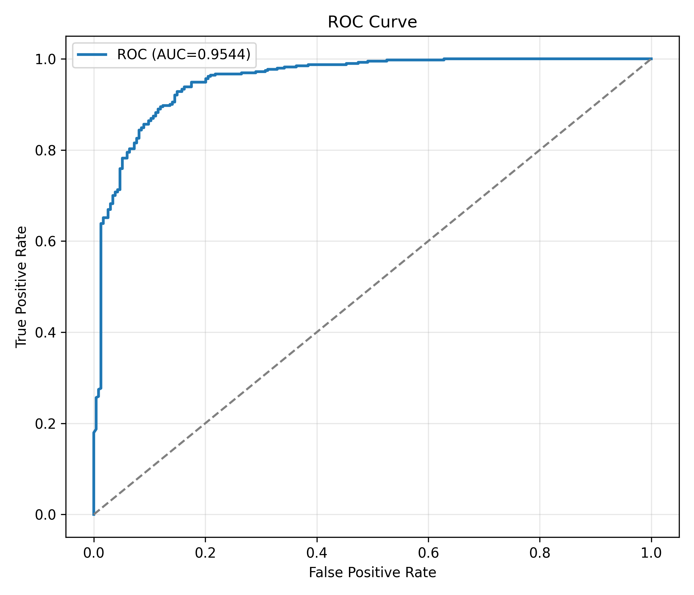

# Quantifying Reliability in Medical Image Classification Using Multi-Factor Trust Metrics

This repository provides an end-to-end research implementation for reliability-aware chest X-ray classification using PyTorch.

## What this project includes

- ResNet18 classifier with Monte Carlo Dropout
- Calibration analysis (ECE + Temperature Scaling)
- 3-model ensemble disagreement estimation
- Clinical risk weighting (Normal vs Pneumonia)
- Final multi-factor trust score and trust-level categorization
- Streamlit dashboard with prediction, trust metrics, and Grad-CAM visualization

## Project structure

```text
project/
│── train.py
│── models.py
│── trust_metrics.py
│── calibration.py
│── ensemble.py
│── dashboard.py
│── utils.py
```

## Artifacts

Training and evaluation outputs are saved in `artifacts/`.

- `artifacts/research_summary.json` → final metrics (Accuracy, AUC, F1, ECE, Brier, Avg Trust)
- `artifacts/trust_analysis.csv` → sample-level uncertainty/disagreement/trust outputs
- `artifacts/figures/` → generated plots

### Sample graphs

#### Calibration Curve (After Temperature Scaling)



#### ROC Curve



### Dashboard Screenshots

#### Dashboard Example 1


#### Dashboard Example 2


## Run

```bash
python project/train.py --data_root "/path/to/chest_xray" --output_dir ./artifacts
python -m streamlit run project/dashboard.py --server.port 8502
```

## Research Paper Draft (IEEE)

The repository includes a publication-style IEEE conference draft:

- [paper/ieee_paper.tex](paper/ieee_paper.tex)
- [paper/references.bib](paper/references.bib)

Compile locally (example):

```bash
cd paper
pdflatex ieee_paper.tex
bibtex ieee_paper
pdflatex ieee_paper.tex
pdflatex ieee_paper.tex
```